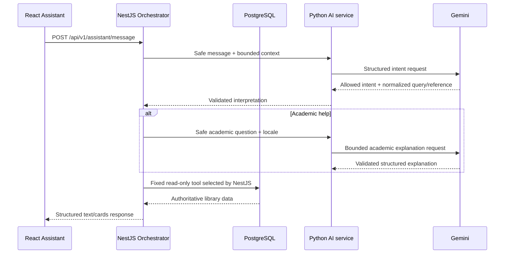

# Delta University Library AI Assistant

## Goal

The Assistant is the primary user-facing AI surface for Delta University Library. It provides a compact Arabic-first, bilingual floating panel for catalog discovery, book availability and location, personalized recommendations, member loans and reservations, and concise academic help. It is read-only and never replaces normal Book Details or circulation workflows.

## Architecture and authority



Gemini is the primary natural-language layer when `ASSISTANT_AI_ENABLED=true` and a server-side key is configured. It understands Arabic/English, selects one bounded intent, resolves simple structured follow-ups, and writes concise academic or catalog-book explanations. NestJS owns authentication, fixed tool selection, catalog/availability/location data, member isolation, validation, deterministic authoritative wording, and all authority. Gemini never accesses PostgreSQL and never decides authoritative availability, locations, due dates, loan states, reservation states, university facts, or IDs.

Intent classification deliberately uses a minimal validated schema: `intent`, nullable `query`, and nullable `referencedBookId`. Academic content is generated only after the validated intent is `ACADEMIC_HELP`, through the separate internal `/assistant/explain-academic` boundary. It returns a title, compact summary, three to five points, and optional example/use case rather than layout-controlling Markdown. Book explanations likewise use `/assistant/explain-book` only after NestJS resolves a real catalog record and return a compact overview, supported topics, cautiously inferred level, optional usefulness note, and an explicit evidence caveat when needed.

## Gemini Catalog Selection

Natural-language `SEARCH_BOOKS` discovery now uses a catalog-grounded selector rather than query expansion. NestJS first runs the existing literal catalog lookup. If the normalized query exactly matches a real title, that direct result is returned without an extra Gemini call. Otherwise, when Assistant AI is enabled, NestJS loads a deterministic bounded projection of active, non-archived, non-deleted Books whose category is active and sends one request to `/assistant/select-catalog`.

The safe candidate projection contains only the real Book ID, title/localized title, subtitle/localized subtitle, author display names, category names, publisher display name, DDC classification, a description truncated to 420 characters when present, and confirmed faculty names. The Book category is the catalog's available structured subject/topic classification; the current schema has no separate topic or keyword entity, so no synthetic topics are added. It omits BookCopy IDs, availability claims, timestamps, audit fields, PDFs/preview content or paths, reservations, loans, account data, JWTs, and student PII. The current user query is redacted before this boundary; conversation history is not sent and normal search is not secretly personalized.

The current development catalog has 73 active Books, so the MVP can fit the active catalog in one compact request. `ASSISTANT_CATALOG_CANDIDATE_LIMIT` defaults to 75 and is hard-capped at 75; `ASSISTANT_CATALOG_PROMPT_MAX_BYTES` defaults to 60,000 and is hard-capped at 80,000. Candidate ordering is deterministic, and both record and serialized-byte limits are enforced before the request. This is intentionally suitable for the current small catalog, not a future large collection.

Gemini returns only `matches: [{ bookId, relevance, reason }]`, where `relevance` is the fixed enum `DIRECT | FOUNDATIONAL | WEAK`, with at most the requested result limit and an allowed empty list. `DIRECT` means the metadata clearly addresses the current request; `FOUNDATIONAL` means a defensible prerequisite for that specific learning goal; `WEAK` means only a broad, incidental, or speculative relationship. The selector is explicitly told never to fill the UI quota and may return any count from zero to the requested maximum. Python validates the minimal schema, discards `WEAK`, invented, or repeated IDs, and preserves only `DIRECT` and `FOUNDATIONAL`. NestJS distrusts the response again: it permits only the same two classes, validates candidate membership, unique IDs, non-empty bounded reasons, and result cap, then reloads every surviving Book from PostgreSQL with current authoritative availability. Relevance is not exposed as authority over Book data; Gemini controls only selection order and the short localized evidence reason.

A valid zero-match response produces an honest localized no-result message rather than unrelated filler. A malformed response, timeout, disabled AI, or service failure falls back to the existing literal catalog search without exposing Gemini details. `searchMode` distinguishes `semantic_catalog`, `exact_lookup`, and `literal_fallback` internally.

`SEARCH_BOOKS` answers the current topic or learning-goal query from the real catalog and sends no member history. The current message dominates intent selection: “عايز كتب تساعدني أبقى Backend developer” is a public catalog learning-goal search, while “رشحلي كتاب مناسب ليا” is a personalized recommendation. `RECOMMEND_BOOKS` remains a separate authenticated capability that uses the existing recommendation service and deliberately bounded recent Loan/Reservation-derived academic-interest signals. No query expansion, synonym generation, embeddings, cosine similarity, vector database, external search, training, or fine-tuning is used.

## Assistant vs recommendation engine

The existing `GET /recommendations/me` pipeline remains intact. `RECOMMEND_BOOKS` calls the same `RecommendationsService`, including its recent Loan/Reservation context, bounded real candidates, Gemini ranking, candidate-ID validation, authoritative Book reload, cold start, and deterministic fallback. The homepage shelf remains a smaller secondary personalization surface.

## Intents and fixed tools

| Intent                 | NestJS tool                                | Authentication     |
| ---------------------- | ------------------------------------------ | ------------------ |
| `RECOMMEND_BOOKS`      | Existing `RecommendationsService`          | MEMBER             |
| `SEARCH_BOOKS`         | Public `CatalogService.listBooks`          | Guest or signed in |
| `BOOK_DETAILS`         | Real Book lookup, then safe AI explanation | Guest or signed in |
| `BOOK_AVAILABILITY`    | Authoritative catalog/copy aggregate       | Guest or signed in |
| `BOOK_LOCATION`        | Confirmed Campus room/floor/shelf data     | Guest or signed in |
| `MY_LOANS`             | Read-only current-member Prisma projection | MEMBER             |
| `MY_RESERVATIONS`      | Read-only current-member Prisma projection | MEMBER             |
| `UNIVERSITY_INFO`      | Trusted application identity facts         | Guest or signed in |
| `ACADEMIC_HELP`        | Gemini concise explanation                 | Guest or signed in |
| `GENERAL_LIBRARY_HELP` | Localized scope guidance                   | Guest or signed in |
| `OUT_OF_SCOPE`         | Short library/academic redirection         | Guest or signed in |

There is no arbitrary tool execution, SQL generation, write intent, reservation mutation, renewal, return, borrowing, pickup, or account change.

## API and response contract

`POST /api/v1/assistant/message` accepts a message of 1–1000 characters, `locale: ar|en`, at most ten safe recent turns, and optional bounded `context` containing at most four `referencedBookIds`, a `selectedBookId`, and `lastIntent`. Context IDs are accepted only when they also occur in structured Assistant history. It never accepts member identity. Optional authentication is read from the Bearer JWT; guest catalog and academic capabilities remain available.

Responses use a compact type plus a localized message, relevant safe data, and updated structured context. Types are `TEXT`, `ACADEMIC_EXPLANATION`, `BOOK_EXPLANATION`, `BOOK_SEARCH_RESULTS`, `BOOK_RECOMMENDATIONS`, `BOOK_DETAILS`, `BOOK_AVAILABILITY`, `BOOK_LOCATION`, `LOANS`, `RESERVATIONS`, `LOGIN_REQUIRED`, and `ERROR`. Academic and Book explanations are structured fields rendered by React, not raw Markdown. Book results link to the existing Book Details route. Loan and reservation cards link to their existing member routes.

## Conversation context

The browser keeps session-only conversation state and sends at most ten recent turns. An Assistant turn carries up to four real Book IDs plus the selected Book and last intent. This resolves sequences such as “طب الثاني متاح؟” → “موجود فين؟” without trusting old Assistant prose. NestJS accepts a referenced ID only when it was in bounded prior structured references and reloads it from the database. No permanent chat history or database table is created.

## Configuration and live activation

```dotenv
RECOMMENDATION_ENABLED=false
ASSISTANT_AI_ENABLED=false
GEMINI_API_KEY=
GEMINI_MODEL=gemini-3.5-flash-lite
RECOMMENDATION_TIMEOUT_MS=8000
ASSISTANT_CATALOG_CANDIDATE_LIMIT=75
ASSISTANT_CATALOG_PROMPT_MAX_BYTES=60000
```

`ASSISTANT_AI_ENABLED` controls Assistant interpretation independently of homepage recommendations; if omitted, the legacy `RECOMMENDATION_ENABLED` value is honored for compatibility. The Python service is the only process that receives `GEMINI_API_KEY` or calls the official `google-genai` SDK. Docker passes the Assistant flag to NestJS and passes the flag, key, and configurable model to Python. Startup logging reports only whether configuration is present and the model name, never the key. Keep both AI flags disabled until a valid server-side key is supplied.

All runtime Gemini paths obtain the model from `GEMINI_MODEL`; the repository default is `gemini-3.5-flash-lite`. Validated output models still reject unexpected fields locally, while their Gemini-facing JSON Schema removes the unsupported `additionalProperties` keyword. The service distinguishes `AI_UNAVAILABLE`, `GEMINI_API_ERROR`, `STRUCTURED_OUTPUT_INVALID`, `INTENT_PARSE_FAILED`, and `TIMEOUT` internally. Safe logs include the stage, model, exception class, status, and a bounded redacted message, never the API key, JWT, authorization header, email, or phone number.

## Book and university questions

`BOOK_DETAILS` first resolves a real catalog Book and sends only its safe title, localized title, author display names, category, bounded description, language, publication year, and whether a catalog preview is present to the internal `/assistant/explain-book` endpoint. Preview content itself is not sent. If evidence is missing, the response explicitly says that its cautious overview is based on catalog metadata and never fabricates chapters, a table of contents, edition-specific content, or publisher claims. If AI is unavailable, NestJS returns the same kind of truthful metadata summary. `UNIVERSITY_INFO` uses only the confirmed names “Delta University for Science and Technology” and “Delta University Library”. The repository contains no confirmed physical university address, so location questions explicitly report that limitation instead of guessing.

## Privacy and prompt-injection safety

Identity comes only from JWT. The AI boundary receives no user/member ID, name, email, phone, membership number, password, token, JWT, authentication header, audit object, full user object, Loan record, Reservation record, or raw Prisma entity. Email, Egyptian mobile-number, and Bearer-token patterns in messages/history are redacted before the AI call.

System instructions treat messages and catalog metadata as untrusted data, forbid tool execution, browsing, SQL, secret/prompt disclosure, and invented library facts. The Python response is schema-validated, intent allow-listed again by NestJS, and book references are constrained to recent structured references.

## Frontend behavior

The floating widget uses the Delta University blue-led visual system: a white panel, pale-blue welcome surface, thin border, restrained orange rule, soft shadow, medium radii, and compact real book/activity cards. Academic answers use a scannable title/definition/points/example/use-case card. Book explanations use the real cover, title, authors, availability, overview, topics, level, usefulness, and source caveat. Contextual actions execute the existing search, follow-up, Book Details, availability, and recommendation paths. Arabic text uses RTL/plaintext bidi handling while code and data-structure examples remain explicitly LTR. It supports a named dialog, Escape close, focus entry/return/trap, visible focus, Enter send, Shift+Enter newline, fixed bottom composer, contextual loading/error announcements, and duplicate-submit protection. At 390px it becomes a near-full-width, safe-area-aware panel.

The four initial quick actions are real Assistant requests: recommend a book, show available books, show my loans, and show my reservations. Guests receive a localized login-required response and the existing safe login return flow for MEMBER-only capabilities.

## Failure and fallback

If Gemini or the Python service is disabled, missing, malformed, or timed out, NestJS uses a conservative bilingual deterministic interpreter for high-confidence catalog/member intents. It recognizes University questions before Book location, resolves structured Book ordinals, and asks “ممكن توضّح سؤالك أكتر؟” for ambiguous one-word follow-ups instead of guessing Book search. Library tools still use real data. Academic help degrades to an honest library-reference offer. Network failures stay inside the widget and never break the surrounding application.

## Testing and limitations

Automated tests mock the Gemini boundary and cover structured academic and Book contracts, schema bounds, missing-description caveats, non-fabrication instructions, intent validation, redaction, hallucinated references, tool mapping, member isolation, read-only behavior, title/point/example rendering, real contextual actions, contextual loading/error states, duplicate submission, guest login, mixed-direction RTL/LTR, and mobile layout. No automated test calls Gemini.

The MVP has no voice, permanent history, write actions, PDF analysis, query expansion, embeddings/vector database, unrestricted general assistant behavior, or response streaming. The all-catalog semantic selection strategy is intentionally limited to the current small catalog; a future large catalog will require a separately designed bounded retrieval stage, without changing the rule that final Books come from PostgreSQL. Live academic, catalog-selection, and catalog-book generation need `ASSISTANT_AI_ENABLED=true` and a configured `GEMINI_API_KEY`; otherwise safe library tools and conservative deterministic interpretation remain available.
