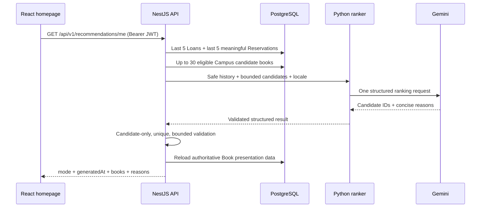

# Delta University Library AI recommendations

## Purpose

The Gemini MVP adds a small, authenticated `مقترحة لك` / `Recommended for You` shelf to the existing Delta University Library homepage. It recommends only real active physical-library books and keeps the existing catalog card, Book Details route, Arabic RTL rhythm, and Delta visual identity. It is a ranking feature, not a chatbot.

## Architecture and data flow



React never calls Gemini. NestJS owns authentication, student history, candidate eligibility, output validation, authoritative catalog loading, and fallback. The Python service has one narrow internal `POST /recommendations/rank` responsibility. Gemini only ranks the supplied candidate IDs and writes short reasons.

## Personalization and privacy

NestJS derives ownership exclusively from the authenticated JWT. The public endpoint accepts only an optional `limit`; it never accepts a member, user, email, or membership identifier.

The MVP uses the newest five Loans and newest five meaningful Reservations (`ACTIVE`, `COLLECTED`, or `EXPIRED`). Duplicate historical books are collapsed. History sent to the ranker contains only localized title, author display names, category, a description truncated to 420 characters, and confirmed book-faculty names. Candidate data adds the technical Book ID and an availability boolean.

The following are explicitly excluded from the AI request: member ID, name, email, phone, membership number, QR data, JWT/refresh tokens, password/authentication fields, audit data, addresses, timestamps, PDF content, raw Prisma objects, and catalog administration metadata. Logs contain counts, mode, latency, and safe error class names only.

The current `User` schema has no faculty, department, or academic-level fields. The service therefore does not invent academic profile data; those fields remain a future enhancement. Book-to-faculty relations are used only when they genuinely exist.

## Candidate restriction and validation

Candidates are active, non-deleted books with an active category and at least one active physical copy assigned to a Delta University Library room. Ordering is deterministic: availability, existing borrow count, recency, then title. The list is capped at 30.

Current active Loan and Reservation books are always excluded. Recent history is normally excluded too; only recent-history exclusion may be relaxed if too few results remain. Gemini receives no more than the bounded candidate list.

Both Python and NestJS validate structured output. NestJS discards malformed entries, IDs outside the supplied candidate set, duplicates, empty reasons, and results over the requested limit. It then reloads the selected books from PostgreSQL and returns only safe presentation fields. Gemini-provided titles, authors, covers, or availability never become authoritative.

## Cold start and fallback

- `personalized`: valid Gemini ranking was used for a member with history.
- `cold_start`: no meaningful Loan or Reservation history exists; Gemini is not called and deterministic real catalog books are returned.
- `fallback`: history exists, but the feature is disabled, the service/key is unavailable, the request times out, or output is invalid/empty. Deterministic real catalog books are returned with wording that does not claim AI personalization.

Recommendation failure never blocks the homepage. The frontend shows bounded loading, honest mode labels, a compact empty state, or a retryable degraded error while all existing homepage sections remain usable.

## Configuration

```dotenv
RECOMMENDATION_SERVICE_URL=http://recommendation-service:8000
RECOMMENDATION_ENABLED=false
GEMINI_API_KEY=
GEMINI_MODEL=gemini-3.5-flash-lite
RECOMMENDATION_LIMIT=4
RECOMMENDATION_CANDIDATE_LIMIT=30
RECOMMENDATION_TIMEOUT_MS=8000
```

`GEMINI_API_KEY` must stay server-side and must never be committed. The official `google-genai` SDK is pinned in the Python service. The default model is configurable and intentionally uses a lightweight model with structured-output support. Disabled mode remains fully functional through deterministic fallback.

No new Redis subsystem was introduced: the repository has a Redis container but no established application cache abstraction. Per-member short-TTL caching can be added later without changing the endpoint contract.

## API contract

`GET /api/v1/recommendations/me?limit=4&locale=ar` requires an authenticated `MEMBER`. `limit` defaults to `RECOMMENDATION_LIMIT`, accepts integers from 1 through 8, and is validated by the global Nest pipe. Optional `locale` accepts only `ar` or `en` so reasons match the current interface; it never controls ownership.

```json
{
  "mode": "personalized",
  "generatedAt": "2026-08-22T10:00:00.000Z",
  "items": [
    {
      "book": {
        "id": "authoritative-book-id",
        "slug": "data-structures",
        "title": "Data Structures",
        "titleAr": "هياكل البيانات",
        "coverImageUrl": null,
        "authors": [],
        "availableCopies": 1,
        "campusAvailability": {
          "hasPhysicalCopies": true,
          "totalCopies": 1,
          "availableCopies": 1,
          "availabilityStatus": "AVAILABLE"
        }
      },
      "reason": "مناسب لاهتمامك السابق ببرمجة الحاسب."
    }
  ]
}
```

Normal repository success envelopes apply in the running API. Raw prompts, raw Gemini responses, candidate context, keys, and stack traces are never returned.

## Testing

Automated tests mock only the Gemini/ranking boundary; they never make paid or network Gemini calls. Coverage includes request and prompt safety in Python, NestJS history/candidate/privacy/validation/fallback orchestration, database-backed JWT/RBAC endpoint access against the isolated test database, and rendered homepage states in RTL/LTR and mobile-width DOM.

Run Python checks from `apps/recommendation-service`:

```bash
python3 -m unittest discover -s tests -v
```

## Limitations and future assistant compatibility

The MVP does not include an academic profile, caching, embeddings, vector search, collaborative filtering, analytics, or a chat UI. The internal rank request reserves an optional bounded `query` field so a separately approved future assistant may reuse the same safe candidate-only ranker. No general prompt or conversation endpoint is exposed in this phase.
