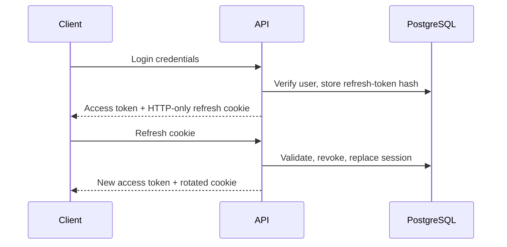

# NAWA Unified Knowledge Platform API

## Delta University faculties

The public faculty foundation uses safe presentation-only endpoints:

```http
GET /api/v1/faculties
GET /api/v1/faculties/:slug
GET /api/v1/books?facultySlug=artificial-intelligence&page=1&limit=12
```

Faculty responses contain `id`, technical `slug`, confirmed `nameAr`, nullable confirmed `nameEn`, `displayOrder`, and `bookCount`. They do not expose audit fields or invent official English labels. The books filter preserves the existing catalog response, pagination, sorting, search, availability, and safety mapping while adding only genuinely assigned `faculties` relations. See `docs/delta-university-faculties.md` for the confirmed list and data-safety rules.

## Phase 5.1 Campus locations and availability

`GET /api/v1/libraries` returns safe summaries of active Campus libraries. `GET /api/v1/libraries/:id` returns the active library → floor → room hierarchy. These reads are public so Book Details can explain where a physical Campus copy lives. They omit timestamps, audit data, copy identifiers, and other administrative fields.

Library structure changes are ADMIN-only:

- `POST /api/v1/libraries` and `PATCH /api/v1/libraries/:id`
- `POST /api/v1/libraries/:libraryId/floors` and `PATCH /api/v1/library-floors/:id`
- `POST /api/v1/library-floors/:floorId/rooms` and `PATCH /api/v1/library-rooms/:id`

Each write validates its active parent, reports uniqueness conflicts safely, and writes an audit record. Librarians retain book/copy management but cannot alter the structural library hierarchy.

Public `GET /api/v1/books/:slug` now includes `campusAvailability`. It contains aggregate `totalCopies`, `availableCopies`, `availabilityStatus`, and safe physical-copy presentation data: status, condition, library, floor, room, exact `shelfLocationCode`, and optional source collection. It intentionally omits internal source references, copy/barcode/QR codes, notes, acquisition metadata, and authentication/audit data. A Store-only title returns `NOT_HELD` with an empty Campus copy list.

`GET /api/v1/books/:id/availability` uses the same safe Campus mapping so detail and availability clients do not drift. Copy management accepts `homeLibraryRoomId`, exact `shelfLocationCode`, `sourceInventoryReference`, and `sourceCollection`; it validates that a selected shelf/section and home room are consistent. Status changes never erase the home location.

### Phase 5.1.5 Campus discovery query

The established public catalog endpoint also powers the marketplace-style Campus page; no duplicate catalog API was introduced:

```http
GET /api/v1/books?campus=true&q=java&available=true&sourceCollection=AI%20%2F%20General%20Programming%20%2F%20ML-DL%20%2F%20Processing&page=1&limit=8
```

- `campus=true` returns only active books with at least one active copy assigned to an active Campus room.
- `available=true` applies to the Campus copies when `campus=true`, rather than to unrelated Store/library copies.
- `q`, `page`, and `limit` retain the normal catalog search and pagination contract.
- `sourceCollection` is an exact optional filter over the three supplied source groups. The response provides a safe `sourceCollections` list for public filter controls.
- Every list item includes only the aggregate `campusAvailability` presentation fields: `hasPhysicalCopies`, `totalCopies`, `availableCopies`, and `availabilityStatus`. Raw Campus copies, source inventory references, barcodes, QR values, and management metadata are omitted.

Ordinary `GET /api/v1/books` behavior is unchanged. It now carries the same safe aggregate Campus availability on each returned book so marketplace cards can show an accurate, subtle Campus badge without a second request.

## Phase 4 Part 1 loans

`POST /api/v1/loans/borrow` and `POST /api/v1/loans/:id/return` require LIBRARIAN or ADMIN. Borrow accepts a member UUID plus one stable copy identifier (copy UUID, copy code, barcode, or QR payload); return requires a `BookCopyCondition` and optional note. `POST /api/v1/loans/:id/renew` permits the owning MEMBER or staff. `GET /api/v1/loans/me` is member-only; staff use `GET /api/v1/loans`, with `q`, status, date-range, member, book, copy, and pagination filters. Loan statuses are computed as active, returned, or overdue from return and due dates. The standard validation response applies to invalid UUIDs, dates, statuses, and conditions; business-rule failures return clear 400/403/409 responses.

Loan list and detail responses include safe book presentation data: nullable `coverImageUrl` and `authors` containing only `id`, `name`, and nullable `arabicName`. Member responses omit issuer/returner fields; staff responses include only their IDs and display names. Authentication fields, tokens, and audit metadata are never included. Borrow and return responses contain the committed final `bookCopy.status`.

Unavailable-copy races and repeated returns return `409 Conflict`. Ineligible accounts, policy-limit/overdue rejections, and archived resources return clear `400` responses; role and ownership violations return `401` or `403` as appropriate.

Swagger is available at `/api/docs`. Phase 2 provides authentication under `/api/v1/auth` and protected user administration under `/api/v1/users`. Access tokens use Bearer authentication; refresh tokens use the HTTP-only cookie `COOKIE_NAME`.

For the staff circulation UI, `GET /api/v1/users/members?q=` is available to LIBRARIAN and ADMIN. It returns a minimal member eligibility summary (verification/status, active and overdue counts, remaining capacity), never authentication secrets.

## Phase 5.2 Campus Reservation Engine

`POST /api/v1/reservations` allows an authenticated active, verified MEMBER to reserve one eligible physical Campus copy for themselves. The request is `{ "bookId": "<uuid>" }`; member identity comes only from the bearer token, and physical-copy selection stays server-side. LIBRARIAN and ADMIN receive `403` from this self-service route.

The server selects deterministically by copy code from active `AVAILABLE` Campus inventory and performs member/book validation, row locking, ACTIVE Reservation creation, `AVAILABLE → RESERVED`, book-counter synchronization, policy-based expiration, and a `RESERVATION_CREATED` audit entry in one serializable transaction. PostgreSQL partial unique indexes and bounded serialization retries protect competing requests. Duplicate reservations and unavailable/raced inventory return `409`; missing active books return `404`; authentication and role failures return `401`/`403`.

The response contains safe reservation and book data, the assigned copy summary, Campus pickup location, and committed availability counters. For this creation response only, the authenticated owning member receives a one-time `pickupToken` for manual presentation at the library; later reservation responses never expose it. It does not contain hashes, member authentication/private fields, barcode/QR values, or internal source/acquisition data.

`POST /api/v1/reservations/collect-by-token` requires `LIBRARIAN` or `ADMIN` and accepts `{ "pickupToken": "<ticket>" }`. It verifies the credential, locks the active reservation/copy, checks borrowing eligibility and overdue/limit policy, then atomically records `COLLECTED`, changes the copy to `BORROWED`, creates a linked Loan, synchronizes counters, and writes `RESERVATION_COLLECTED`. Invalid format is `400`, an unknown credential is `404`, and terminal/expired/ineligible/concurrent states are `409`; a MEMBER receives `403`.

### Reservation queries, cancellation, and expiration

`GET /api/v1/reservations/me` is MEMBER-only and derives ownership from JWT. It returns deterministic newest-first pagination (`page`, `limit`, maximum 50) and accepts `status=active|cancelled|expired|collected|all`; malformed status, non-integer, non-positive, and oversized pagination values return `400`. `GET /api/v1/reservations/:id` validates UUID format and permits only the owning member. Both return safe book presentation data (title, localized title, slug, cover, and author `id`/`name`/`nameAr`), safe copy/location data, and `canCancel`; they never return member authentication data, QR/pickup tokens, barcodes, or acquisition/source metadata.

`POST /api/v1/reservations/:id/cancel` locks an owned reservation and atomically changes `ACTIVE → CANCELLED`, releases `RESERVED → AVAILABLE`, synchronizes inventory, and writes one `RESERVATION_CANCELLED` audit event. Missing, foreign, terminal, already-expired, and inconsistent records use the normal `404`/`403`/`409` errors.

Due reservations are processed at backend startup and every 60 seconds by default. `RESERVATION_EXPIRATION_INTERVAL_MS` accepts an integer from 5000 through 2147483647; invalid values fall back to 60000, passes do not overlap within one process, and shutdown clears the timer. Each due row is locked and atomically changed `ACTIVE → EXPIRED` with copy release, counter synchronization, and one system-actor `RESERVATION_EXPIRED` audit. Processing is idempotent and safe across competing workers, and one failed row does not block unrelated candidates. Queries and new creation also defensively process relevant stale rows using the same transition logic. Phase 5.2 did not implement a frontend; collection, pickup/QR/scanning, Loan conversion, and notifications remain unimplemented.

### Phase 5.3.1 frontend integration

Campus Book Details calls the existing `POST /api/v1/reservations` endpoint with `{ "bookId": "<uuid>" }` and the restored or newly issued member access token. It never sends `memberId` or `bookCopyId`. The frontend treats the response as the source of truth for `status`, assigned copy code, pickup location, and formatted `expiresAt`; it does not calculate the reservation window locally. HTTP `401`, `403`, `404`, duplicate/no-copy `409`, and unexpected failures map to localized member-safe feedback while the backend contract and permissions remain unchanged.

### Phase 5.3.2A member query integration

The protected `/my-reservations` frontend requests `GET /reservations/me?status=<filter>&page=<page>&limit=12`; filtering and pagination remain server-side. `/my-reservations/:id` requests the ownership-protected detail endpoint rather than reusing or guessing list data. A stale `401` recovers through the existing login/return flow, ordinary failures remain retryable in place, and `403`/`404` details are rendered as safe localized states. This integration is read-only and does not call the existing cancellation endpoint.

### Phase 5.3.2B cancellation and deadline integration

The completed My Reservations frontend calls `POST /reservations/:id/cancel` only after an accessible confirmation and only when the preceding safe response contains `canCancel: true`. The request carries no client-computed status, copy state, member identity, or expiration value. Pending confirmation is disabled and guarded against duplicate submission; a success uses the committed reservation response and then refreshes the current server-side filter.

Cancellation `403` and `404` responses receive safe localized feedback. A `409` is treated as a lifecycle race and followed by the ownership-protected `GET /reservations/:id`; the returned status determines whether the member sees already-cancelled, expired, or generic changed-state feedback. Network failures remain retryable without optimistic mutation.

The frontend derives human-readable remaining time exclusively from the response `expiresAt`. It updates presentation at minute-level intervals and performs one authoritative list/detail refresh when a visible ACTIVE deadline passes. `GET` query-time expiration processing or the backend scheduler decides the actual status; the client does not call an expiration endpoint, persist `EXPIRED`, or poll the API every second.

## Phase 3 catalog

Public catalog endpoints are available under `/api/v1/books`, including search (`q`), category and language filters, availability filtering, pagination, a slug detail endpoint, and availability by location. `GET /categories`, `/authors`, `/publishers`, `/sections`, and `/shelves` provide active master data for catalog forms.

Librarians and administrators may create or update books and copies, change copy statuses, archive or restore books/copies, and retrieve a copy QR payload. The service validates ISBN/slug/copy-code/barcode uniqueness through database constraints, validates a shelf against its section, and recalculates book availability within the same database transaction as every copy change.

### Administrative archive access

`GET /api/v1/books` remains public and returns active books by default. `archiveState=active|archived|all` (or `includeArchived=true`) is restricted to LIBRARIAN and ADMIN; unauthenticated and MEMBER requests for archived data receive a forbidden response. Search, pagination, sorting, and archive metadata are preserved for those management views.

`GET /api/v1/book-copies` is restricted to LIBRARIAN and ADMIN. It supports `q`, `bookId`, `status`, `condition`, `sectionId`, `shelfId`, `archiveState`, `page`, and `limit`, and returns related book/location data without acquisition details. `GET /api/v1/book-copies/:id` retrieves one active or archived management record.

Restoring a book changes only the book archive state; it does not restore any archived copies. Restoring a copy sets it to `AVAILABLE` and recalculates its book’s `totalCopies` and `availableCopies` transactionally. Archive and restore actions write audit logs.

Administrators additionally manage categories, authors, publishers, sections, and shelves. Each master-data resource supports create, update, archive, and restore. Archive/restore and inventory changes write audit records.

| Role          | Catalog permissions                                            |
| ------------- | -------------------------------------------------------------- |
| Public/member | Browse and search the active catalog                           |
| Librarian     | Manage books, copies, status, QR payloads, and archive/restore |
| Administrator | Librarian permissions plus master-data management              |



# Book preview PDFs

Book detail and list responses include safe optional `preview` presentation metadata. Internal storage keys and filesystem paths are never returned. See [Book Preview PDF](book-preview-pdf.md) for the complete contract and storage rules.

- `POST /api/v1/books/:bookId/preview-pdf` — `LIBRARIAN`/`ADMIN`, multipart field `file`, uploads or safely replaces a PDF.
- `GET /api/v1/books/:bookId/preview-pdf` — authenticated users, streams `application/pdf` inline.
- `DELETE /api/v1/books/:bookId/preview-pdf` — `LIBRARIAN`/`ADMIN`, safely and idempotently removes the asset.

## AI-assisted member recommendations

`GET /api/v1/recommendations/me?limit=4&locale=ar` is available only to an authenticated `MEMBER`. Identity comes from JWT; the endpoint never accepts `memberId`, `userId`, email, or membership number. `limit` is optional, defaults to the configured recommendation limit, and is validated from 1 through 8. `locale` is optional and restricted to `ar|en`; it localizes reasons but never changes ownership.

The response contains `mode` (`personalized`, `cold_start`, or `fallback`), `generatedAt`, and ranked `items`. Each item combines a concise reason with safe authoritative Book presentation data loaded from PostgreSQL after AI-output validation. No prompt, raw Gemini response, private member data, authentication data, or internal candidate payload is exposed. Swagger documents the endpoint under `Recommendations`.

See [AI recommendations](ai-recommendations.md) for the complete privacy, candidate, structured-output, cold-start, and deterministic fallback contract.

## Delta University Library AI Assistant

`POST /api/v1/assistant/message` is a read-only bilingual Assistant endpoint. The body contains `message` (1–1000 characters), optional `locale: ar|en`, at most ten compact conversation turns, and optional structured `context: { referencedBookIds, selectedBookId, lastIntent }`. Context is capped and validated against prior structured Book references; it cannot contain identity. An optional Bearer JWT enables MEMBER-only recommendations, loans, and reservations; guests retain book search, real-book explanations, availability, confirmed location, academic help, trusted university information, and general library guidance.

The internal Python contract uses `POST /assistant/interpret` for the minimal validated intent/query/reference result, `POST /assistant/explain-academic` for a bounded structured academic answer after classification, `POST /assistant/explain-book` for a structured explanation of a safe backend-supplied real Book projection, and `POST /assistant/select-catalog` to select semantically relevant IDs from a bounded real catalog projection. These are service-to-service boundaries; they accept no member identity and own no library data or write action.

The response type is one of `TEXT`, `ACADEMIC_EXPLANATION`, `BOOK_EXPLANATION`, `BOOK_SEARCH_RESULTS`, `BOOK_RECOMMENDATIONS`, `BOOK_DETAILS`, `BOOK_AVAILABILITY`, `BOOK_LOCATION`, `LOANS`, `RESERVATIONS`, `LOGIN_REQUIRED`, or `ERROR`, with safe presentation data and the next bounded context. `ACADEMIC_EXPLANATION` contains `title`, `summary`, three to five `keyPoints`, optional `example`/`useCase`, and one to three executable suggestions. `BOOK_EXPLANATION` contains the authoritative Book presentation record plus `overview`, up to four `topics`, a bounded `level`, optional `whyUseful`, and a source `caveat` when catalog evidence is limited. Semantic `BOOK_SEARCH_RESULTS` accepts only Gemini matches classified internally as `DIRECT` or `FOUNDATIONAL`, may honestly contain fewer than four or zero Books, and may add a short localized `semanticReason` to each authoritative Book plus an internal `searchMode` of `semantic_catalog`, `exact_lookup`, or `literal_fallback`. Current learning-goal search never receives member Loan/Reservation history; personalized `RECOMMEND_BOOKS` remains separate. NestJS obtains all library facts from PostgreSQL and permits no Assistant write action. See [AI Assistant](ai-assistant.md) for live activation, tools, authority, privacy, conversation references, fallback, and frontend behavior.

### Librarian book covers

`POST /api/v1/books/:id/cover` accepts a JPEG, PNG, or WebP image up to 5 MB and requires `LIBRARIAN` or `ADMIN`. The image is stored by the existing catalog asset boundary, the book `coverImageUrl` is updated, and a cover upload/replacement audit event is written. The public stream endpoint is `GET /api/v1/books/:id/cover/:key`.
