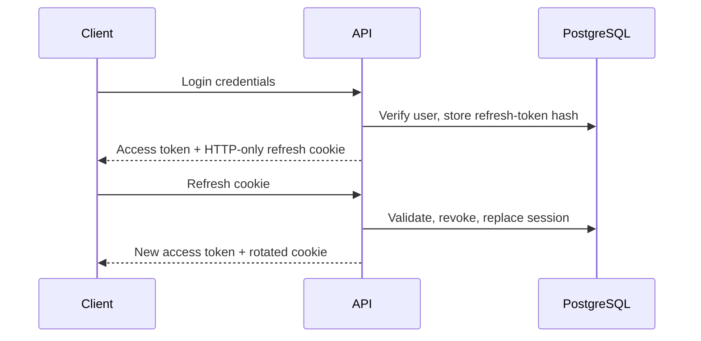

# Smart Library API

## Phase 4 Part 1 loans

`POST /api/v1/loans/borrow` and `POST /api/v1/loans/:id/return` require LIBRARIAN or ADMIN. Borrow accepts a member UUID plus one stable copy identifier (copy UUID, copy code, barcode, or QR payload); return requires a `BookCopyCondition` and optional note. `POST /api/v1/loans/:id/renew` permits the owning MEMBER or staff. `GET /api/v1/loans/me` is member-only; staff use `GET /api/v1/loans`, with `q`, status, date-range, member, book, copy, and pagination filters. Loan statuses are computed as active, returned, or overdue from return and due dates. The standard validation response applies to invalid UUIDs, dates, statuses, and conditions; business-rule failures return clear 400/403/409 responses.

Loan list and detail responses include safe book presentation data: nullable `coverImageUrl` and `authors` containing only `id`, `name`, and nullable `arabicName`. Member responses omit issuer/returner fields; staff responses include only their IDs and display names. Authentication fields, tokens, and audit metadata are never included. Borrow and return responses contain the committed final `bookCopy.status`.

Unavailable-copy races and repeated returns return `409 Conflict`. Ineligible accounts, policy-limit/overdue rejections, and archived resources return clear `400` responses; role and ownership violations return `401` or `403` as appropriate.

Swagger is available at `/api/docs`. Phase 2 provides authentication under `/api/v1/auth` and protected user administration under `/api/v1/users`. Access tokens use Bearer authentication; refresh tokens use the HTTP-only cookie `COOKIE_NAME`.

For the staff circulation UI, `GET /api/v1/users/members?q=` is available to LIBRARIAN and ADMIN. It returns a minimal member eligibility summary (verification/status, active and overdue counts, remaining capacity), never authentication secrets.

## Phase 3 catalog

Public catalog endpoints are available under `/api/v1/books`, including search (`q`), category and language filters, availability filtering, pagination, a slug detail endpoint, and availability by location. `GET /categories`, `/authors`, `/publishers`, `/sections`, and `/shelves` provide active master data for catalog forms.

Librarians and administrators may create or update books and copies, change copy statuses, archive or restore books/copies, and retrieve a copy QR payload. The service validates ISBN/slug/copy-code/barcode uniqueness through database constraints, validates a shelf against its section, and recalculates book availability within the same database transaction as every copy change.

### Administrative archive access

`GET /api/v1/books` remains public and returns active books by default. `archiveState=active|archived|all` (or `includeArchived=true`) is restricted to LIBRARIAN and ADMIN; unauthenticated and MEMBER requests for archived data receive a forbidden response. Search, pagination, sorting, and archive metadata are preserved for those management views.

`GET /api/v1/book-copies` is restricted to LIBRARIAN and ADMIN. It supports `q`, `bookId`, `status`, `condition`, `sectionId`, `shelfId`, `archiveState`, `page`, and `limit`, and returns related book/location data without acquisition details. `GET /api/v1/book-copies/:id` retrieves one active or archived management record.

Restoring a book changes only the book archive state; it does not restore any archived copies. Restoring a copy sets it to `AVAILABLE` and recalculates its book’s `totalCopies` and `availableCopies` transactionally. Archive and restore actions write audit logs.

Administrators additionally manage categories, authors, publishers, sections, and shelves. Each master-data resource supports create, update, archive, and restore. Archive/restore and inventory changes write audit records.

| Role          | Catalog permissions                                            |
| ------------- | -------------------------------------------------------------- |
| Public/member | Browse and search the active catalog                           |
| Librarian     | Manage books, copies, status, QR payloads, and archive/restore |
| Administrator | Librarian permissions plus master-data management              |

