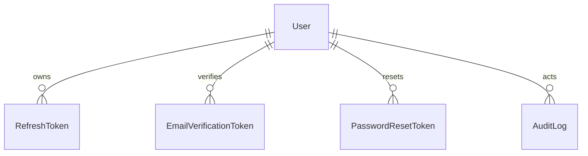

# Phase 2 database

PostgreSQL is accessed exclusively through Prisma. The initial schema defines users, secure refresh sessions, email-verification and password-reset tokens, audit logs, and future system settings. Tokens are SHA-256 hashes; password hashes are Argon2.

Run `npm run prisma:migrate:dev --workspace=@smart-library/backend`, then `npm run prisma:seed --workspace=@smart-library/backend`.

# Phase 4 Part 1

`Loan` links a member, a physical `BookCopy`, and issuing/returning staff. It records due and return dates, renewal state, return condition, and notes. Indexed member/copy/status fields support operational loan listings. The `borrowing_and_loan_lifecycle` migration introduces `LoanStatus` and the loan table.
