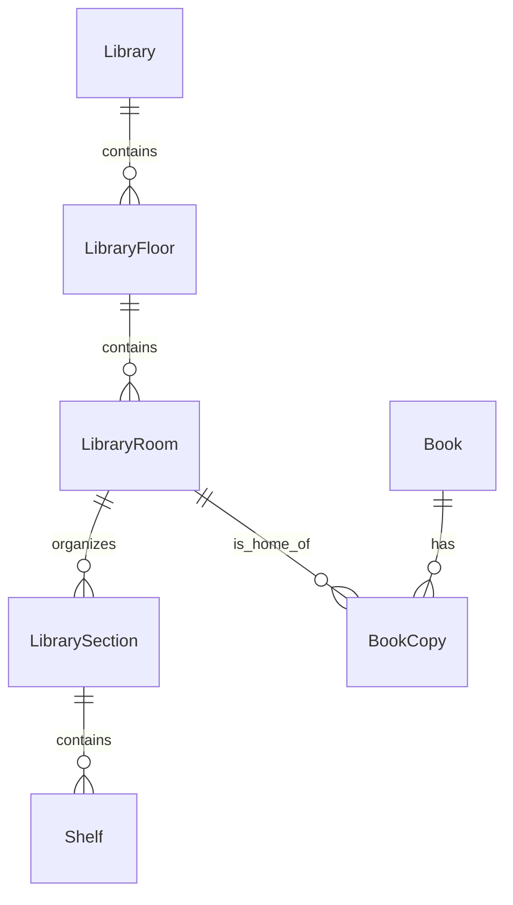
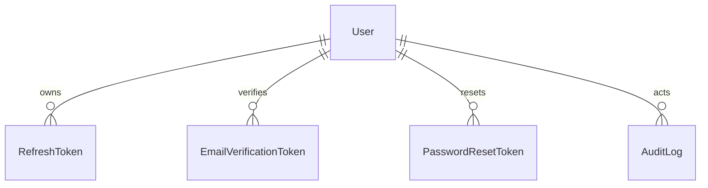

# NAWA database

## Phase 5.1 Campus location structure

The `nawa_campus_location_structure` migration keeps `Book` as the central catalog entity and adds normalized physical-location data:

- `Library` stores bilingual identity, a stable unique code, an optional building, and active state.
- `LibraryFloor` belongs to one library and has a unique floor number within that library.
- `LibraryRoom` belongs to one floor and has a unique room number within that floor.
- `LibrarySection.roomId` connects the established section/shelf organization to a real room.
- `BookCopy.homeLibraryRoomId` is the physical home room. It persists when the operational status becomes borrowed, damaged, or maintenance.
- `BookCopy.shelfLocationCode` stores the supplied opaque code verbatim; values such as `1,2/1` are not parsed or normalized.
- `BookCopy.sourceInventoryReference` provides an idempotent unique source-row identity, while `sourceCollection` retains the supplied group only when one exists.
- `Book.sourcePublicationInfo` preserves the raw source publication/publisher text; `Book.ddc` stores a supplied DDC value without invention.

The real Phase 5.1 hierarchy is College Library / `مكتبة الكلية` → Floor 3 / `الدور الثالث` → Room 315 / `غرفة 315`. No building was supplied, so `building` remains null. Existing sections and shelves provide an organizational anchor, while the authoritative source shelf code remains on each physical copy.

The migration is additive and non-destructive. It does not reset or delete Store books, copies, loans, authentication data, or audit history. Both development and isolated test databases must apply it through `prisma migrate deploy`.

## Phase 2 authentication foundation

PostgreSQL is accessed exclusively through Prisma. The initial schema defines users, secure refresh sessions, email-verification and password-reset tokens, audit logs, and future system settings. Tokens are SHA-256 hashes; password hashes are Argon2.

Run `npm run prisma:migrate:dev --workspace=@smart-library/backend`, then `npm run prisma:seed --workspace=@smart-library/backend`.

# Phase 4 Part 1

`Loan` links a member, a physical `BookCopy`, and issuing/returning staff. It records due and return dates, renewal state, return condition, and notes. Indexed member/copy/status fields support operational loan listings. The `borrowing_and_loan_lifecycle` migration introduces `LoanStatus` and the loan table.

Borrow, return, and renewal run as serializable transactions. Borrow/return lock the target `BookCopy`; serialization failures are retried, and an unavailable competing operation returns a conflict. Loan state, copy state, book inventory counters, and audit records commit atomically. Effective overdue status is calculated from `returnedAt` and `dueAt`, so correctness does not depend on a scheduler.

Both `smart_library` and isolated `smart_library_test` have all three migrations applied. The verified development seed contains 10 categories, 20 authors, 5 publishers, 5 sections, 15 shelves, 50 books, 130 copies, and four Phase 4 loans. Final consistency checks found no active-loan/copy mismatches, duplicate active loans per copy, or book counter mismatches.

## Phase 5.2.1 reservation foundation

`Reservation` records a member's time-limited claim on one physical `BookCopy` before a `Loan` exists. It references the member, central `Book`, and chosen copy with restrictive foreign keys so archiving or changing related records cannot erase reservation history. Its lifecycle is `ACTIVE`, `CANCELLED`, `EXPIRED`, or `COLLECTED`; the physical copy independently uses `BookCopyStatus.RESERVED` while the claim is active.

PostgreSQL partial unique indexes `Reservation_active_bookCopyId_key` and `Reservation_active_memberId_bookId_key` both use the exact predicate `WHERE status = 'ACTIVE'`. They preserve terminal history while allowing at most one ACTIVE reservation for a copy and at most one ACTIVE reservation for a member/book pair. Supporting indexes cover member/status/expiration history, book/status/expiration release checks, copy/status lookup, and the due `status/expiresAt` scan; the primary key covers detail lookup. No additional acceptance migration was needed.

Create, cancel, and expire use serializable transactions, PostgreSQL row locks, the established catalog counter synchronizer, and in-transaction audit writes. Catalog management cannot assign `RESERVED`, mutate/archive an actively reserved copy, or archive its book; this keeps ACTIVE reservation state under the Reservation Engine's control. The pickup window is read from numeric `SystemSetting` key `reservation.pickupWindowHours`; seeded environments use 24 hours and the policy service has the same safe fallback.

## Reservation pickup and collection

The `reservation_pickup_collection` migration adds nullable `Reservation.pickupTokenHash`, `pickupTokenExpiresAt`, and `collectedByUserId`, plus a restrictive collector foreign key. Pickup secrets use cryptographic randomness and only their Argon2 hashes are persisted; the member presents the one-time credential manually.

`Loan.reservationId` remains null for ordinary circulation but is unique for collection-created loans. With serializable Reservation/BookCopy locks, it ensures a collection cannot create two loans. A committed collection links the Loan, records collecting staff/time, transitions `ACTIVE → COLLECTED` and `RESERVED → BORROWED`, synchronizes counters, and writes its audit event in the same transaction.
