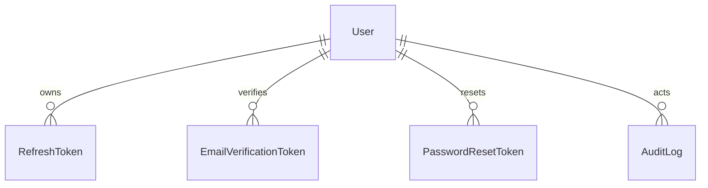

# Phase 2 database

PostgreSQL is accessed exclusively through Prisma. The initial schema defines users, secure refresh sessions, email-verification and password-reset tokens, audit logs, and future system settings. Tokens are SHA-256 hashes; password hashes are Argon2.

Run `npm run prisma:migrate:dev --workspace=@smart-library/backend`, then `npm run prisma:seed --workspace=@smart-library/backend`.

# Phase 4 Part 1

`Loan` links a member, a physical `BookCopy`, and issuing/returning staff. It records due and return dates, renewal state, return condition, and notes. Indexed member/copy/status fields support operational loan listings. The `borrowing_and_loan_lifecycle` migration introduces `LoanStatus` and the loan table.

Borrow, return, and renewal run as serializable transactions. Borrow/return lock the target `BookCopy`; serialization failures are retried, and an unavailable competing operation returns a conflict. Loan state, copy state, book inventory counters, and audit records commit atomically. Effective overdue status is calculated from `returnedAt` and `dueAt`, so correctness does not depend on a scheduler.

Both `smart_library` and isolated `smart_library_test` have all three migrations applied. The verified development seed contains 10 categories, 20 authors, 5 publishers, 5 sections, 15 shelves, 50 books, 130 copies, and four Phase 4 loans. Final consistency checks found no active-loan/copy mismatches, duplicate active loans per copy, or book counter mismatches.
